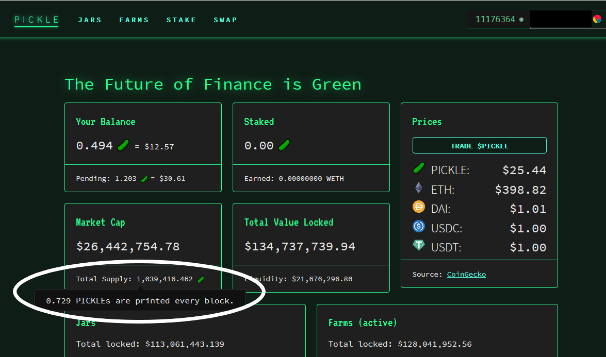

# Emission Schedule

For the current rate of PICKLE emissions, please navigate to [https://app.pickle.finance/](https://app.pickle.finance/) and hold your mouse over the TOTAL SUPPLY.

You can also see the live circulating supply [here](https://duneanalytics.com/embeds/12459/24916/fPVi6QwWPaxGaIoIhEegry7tN8iVEaIaRHOv1xk7).

2020 September 11: Week 1 begins.

2021 March 15 (week 28): [PIP-32](https://forum.pickle.finance/t/rfc-modifying-tail-end-emissions/1016) vote to maintain emissions at 0.1 pickle/block.\
\
2021 May 13 (week 37): [Snapshot](https://snapshot.org/#/pickle.eth/proposal/QmP5rBjrZinv9Hr8rhcZCVK2mnJeAATxhM876JitmhbP1q) vote to expand emissions to 0.3 pickle/block.

Pickle tokenomics officially began it's first week of emissions on Friday, September 11, 2020. The first week created 465,000 Pickle tokens. The next 3 weeks saw half as many pickles created each week as the week before, with emissions of 232k, 116k and 58k respectively. At week 5, the pattern of halving emissions each week stopped. Week 5 saw a 20% decline in emissions vs the prior week, with 46k tokens created, while weeks 6 through 28 saw pickle emissions decreasing by 10% each week.

The original tokenomics plan called for a 10% reduction in emissions in perpetuity until emissions reached the terminal figure of 329 pickles per week. However, on March 15th, 2021, a snapshot vote was held for PIP-32, freezing emissions at 0.1 per block (or around 4200 per week) to maintain some room for growth for the protocol.

After the release of dill and plans to expand Pickle onto the Polygon network, a new snapshot vote was held on May 13th to expand emissions to 0.3 pickles per block, or around 12,600 per week, in order to support these expansion plans and compete for deposits in new markets. The new emissions schedule will last until the end of 2021.

Below is the original emission.

The PICKLE emission schedule features a gradual decrease in PICKLE minting up until the end of the first year, after which a static amount will be minted in perpetuity.

Starting from Week 6 and ending at the end of Week 52, the number of PICKLEs minted will decline each week by 10% from the previous week.

After Week 52, PICKLEs minted will remain static each week (at approx. 329 PICKLEs per week), capping the overall annualized inflation rate at 1.29% and further decreasing over time.

.png>)

| **Week** | **New PICKLEs per Week** | **Total PICKLE Supply** |
| -------- | ------------------------ | ----------------------- |
| **1**    | **465,000**              | **465,000**             |
| **2**    | **232,500**              | **697,500**             |
| **3**    | **116,250**              | **813,750**             |
| **4**    | **58,125**               | **871,875**             |
| **5**    | **46,500**               | **918,375**             |
| **6**    | **41,850**               | **960,225**             |
| **7**    | **37,665**               | **997,890**             |
| **…**    | **…**                    | **…**                   |
| **51**   | **365**                  | **1,333,588**           |
| **52**   | **329**                  | **1,333,916**           |
| **53**   | **329**                  | **1,334,245**           |
| **…**    | **…**                    | **…**                   |
| **104**  | **329**                  | **1,351,024**           |
| ...      | **329**                  | ...                     |

