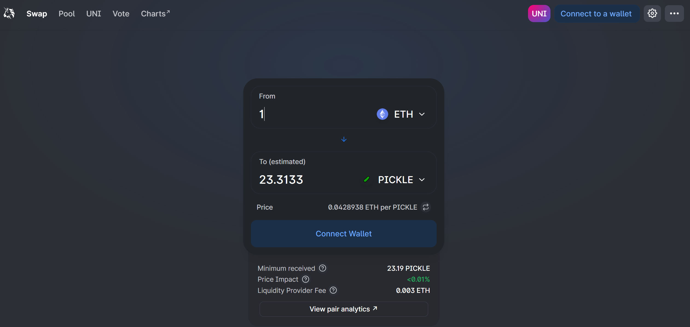
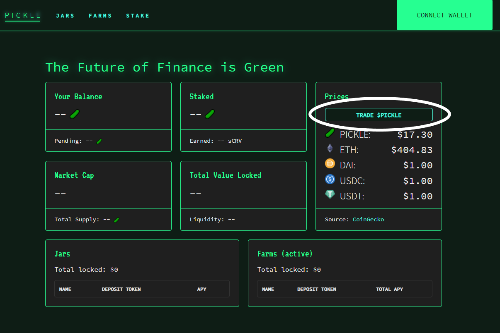

# How to Get PICKLEs

Looking to get your hands on some PICKLE tokens? You've come to the right place!

The easiest way to trade PICKLE tokens is through Uniswap by clicking [**here**](https://app.uniswap.org/#/swap?inputCurrency=0x429881672b9ae42b8eba0e26cd9c73711b891ca5\&outputCurrency=ETH).&#x20;

Before confirming your transaction, always verify the PICKLE token smart contract address: [**0x429881672b9ae42b8eba0e26cd9c73711b891ca5**](https://etherscan.io/address/0x429881672B9AE42b8EbA0E26cD9C73711b891Ca5)****

You can also click on the **TRADE $PICKLE** link on our [website](https://app.pickle.finance/) to be redirected to the Uniswap Pool.

### Centralized Exchanges

PICKLE tokens are listed on a number of centralized exchanges, including on [OKEX](https://www.okex.com/), [Bilaxy](https://bilaxy.com/), [MXC](https://www.mxc.com/), [AEX](https://www.aex.com/page/trade.html?mk\_type=USDT\&trade\_coin\_name=PICKLE#/) and [Hotbit](https://www.hotbit.io/exchange?symbol=PICKLE\_USDT).&#x20;

### Decentralized Exchanges 

PICKLE tokens are also listed on [UNISWAP](https://info.uniswap.org/pair/0xdc98556ce24f007a5ef6dc1ce96322d65832a819), [Sushiswap](https://sushiswap.fi/pair/0x269db91fc3c7fcc275c2e6f22e5552504512811c) and [1inch](https://1inch.exchange/#/r/0xb4522eB2cA49963De9c3dC69023cBe6D53489C98).&#x20;

###
