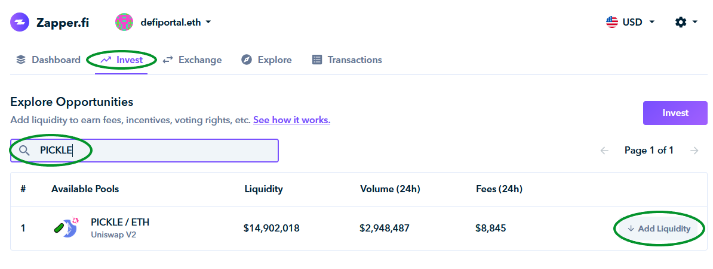
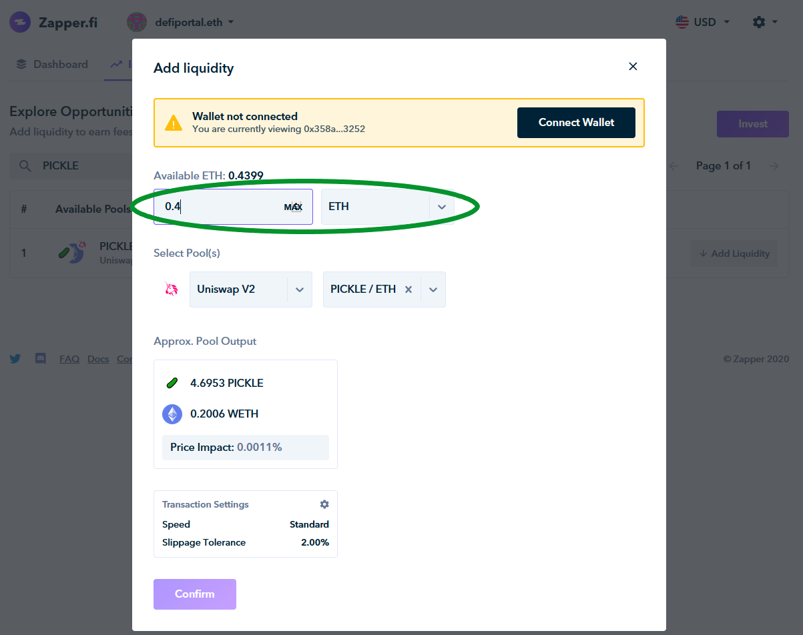
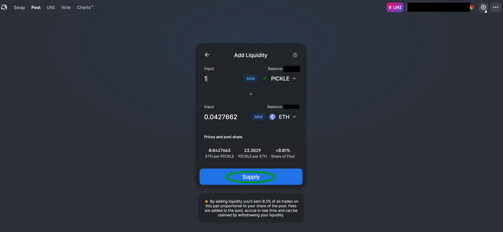
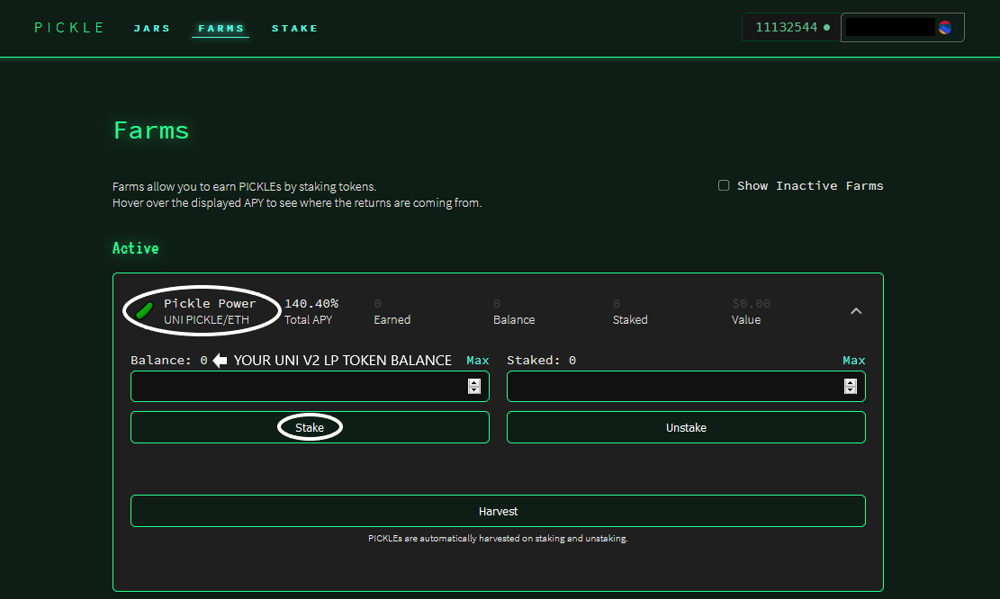

# PICKLE/ETH Farm

#### WARNING: Providing Liquidity carries risks, including but not limited to Impermanent Loss. Please do your own research before depositing funds.

Want to maximize your PICKLE rewards? Look no further.

The PICKLE/ETH 50:50 Uniswap pool is the primary source of liquidity for PICKLE tokens.

### Farming PICKLE

Farming PICKLE tokens by supplying liquidity to the PICKLE/ETH pool consists of 2 steps:

1. Supplying ETH and PICKLE tokens on Uniswap
2. Staking the Uniswap Liquidity Provider (LP) tokens from Step 1 in the Pickle Power farm [here](https://app.pickle.finance/farms)

**IMPORTANT: You will only earn PICKLE rewards once both steps are completed.**

## **Adding Liquidity**

### Option 1 - Zapper.fi Integration

&#x20;Zapper.fi users can add liquidity to the PICKLE/ETH pool by doing the following:

1. Click on the **INVEST** tab
2. Search for **PICKLE**
3. Click on **ADD LIQUIDITY**

On the following page, choose the token that you would like to deposit (ETH or PICKLE) and confirm the transaction.

### Option 2 - Adding Liquidity on Uniswap

In order to add liquidity on Uniswap, you will first need PICKLEs and ETH in equal quantities.

You can trade ETH for PICKLE tokens [here](https://app.uniswap.org/#/swap?inputCurrency=0x429881672b9ae42b8eba0e26cd9c73711b891ca5\&outputCurrency=ETH).&#x20;

Before confirming any transactions, always verify the PICKLE token smart contract address: **0x429881672b9ae42b8eba0e26cd9c73711b891ca5**

Once you have obtained ETH and PICKLE tokens in a 50:50 ratio, proceed to the Uniswap pool [here](https://app.uniswap.org/#/add/0x429881672b9ae42b8eba0e26cd9c73711b891ca5/ETH).

Enter the amount of ETH or PICKLE that you would like to supply, and Uniswap will automatically populate the corresponding amount of the other token to ensure a 50:50 ratio. Click **SUPPLY** to add liquidity.

_Please note that you will have to approve spending limits for your ETH and PICKLE tokens when you do this for the first time._

### Staking LP tokens for PICKLE rewards

Once you supply tokens to Uniswap, you will receive UNI V2 LP tokens representing your share of the PICKLE/ETH pool. Head over to the Pickle Power farm [here](https://app.pickle.finance/farms).

If you have followed the instructions correctly, your UNI V2 token balance should appear where highlighted above. Stake your LP tokens and confirm the transaction.&#x20;

_Please note that you will have to approve a spending limit for your LP tokens when you do this for the first time._

Welcome to PICKLE Finance! You will immediately start earning PICKLE rewards, which you can track on our website.

If you are facing any issues, please feel free to reach out to us at our Discord [here](https://discord.gg/kzzn2Wr). We have a very helpful community that is always eager to help.

The Future of Finance is Green &#x20;
